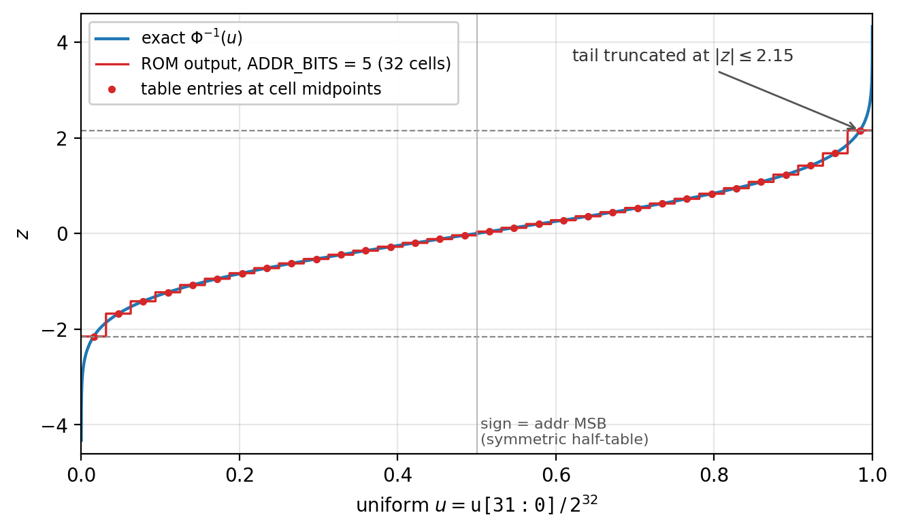
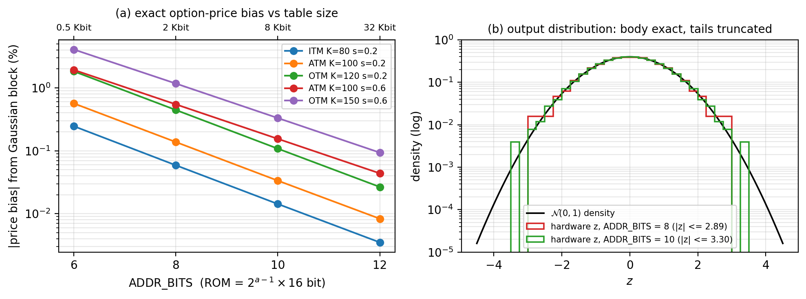

# Work plan: Gaussian lookup and fixed-point representation

_Owner: Chuanqi Chen. Started 2026-10-03, revised 2026-10-03 after the lane interface spec. Companion to `Project_Proposal.md` and `Lane_Interface_Spec.md`._

---

## 1. What this block is

The lane computes $S_T = e^{A + Bz}$. The RNG (Shentong) produces a 32-bit uniform
word `u`; the datapath (Eric) needs a fixed-point standard-normal sample $z$. This
block sits between them and is the only place in the lane where a *distribution* is
changed:


The responsibility has two halves:

1. **Gaussian lookup** - the inverse-CDF (quantile) table $z = \Phi^{-1}(u)$, its RTL, its
   generator script, and the evidence that it is accurate enough for option pricing.
2. **Fixed-point representation** - the numeric formats and the single
   rounding/saturation policy for *every* quantity in the lane ($z$, $A$, $B$, $x = A + Bz$,
   $S_T$, payoff, accumulator). The datapath is Eric's, but the formats are a shared
   contract, and the bit-accurate Python reference must use one rounding rule
   everywhere (`model/fxp.py`).

This is also the project's **numerical tradeoff knob**: the proposal promises to vary
"lookup resolution or fixed-point width" and show accuracy vs. hardware cost. That
study is owned here.

## 2. Background: how a Gaussian lookup works

### 2.1 Inverse transform sampling

If $U$ is uniform on $(0,1)$ and $\Phi$ is the standard-normal CDF, then

$$
Z = \Phi^{-1}(U) \;\sim\; \mathcal{N}(0,1),
$$

because $\Pr[Z \le z] = \Pr[U \le \Phi(z)] = \Phi(z)$. So a Gaussian sample is just a
*function evaluation* on a uniform sample - no rejection, no loops, one output per
input. In hardware that function is a table: the uniform word indexes the table, and
the table holds precomputed values of $\Phi^{-1}$.

$\Phi^{-1}$ has no closed form, but we never need it at run time: Python computes the
entries once (with `NormalDist.inv_cdf` from the standard library), and the hardware
only stores them.

### 2.2 Why a table and not Box-Muller or a sum of uniforms

| Method | Hardware per sample | RNG words | Tail quality | Fit for 1 trial/lane/cycle |
|----------------|------------------------|--------:|------------------------|----------------|
| Box-Muller | $\ln$, $\sqrt{\cdot}$, $\sin$, $\cos$ units | 1 | exact in principle, precision-limited | heavy; multi-cycle |
| Central-limit (sum of $n$ uniforms) | $n$ adders | $n$ (e.g. 12) | poor: bounded at $\pm\sqrt{3n}$, wrong kurtosis | needs $n$ RNG words |
| **Inverse-CDF table** | ROM + negate | **1** | **tunable: set by table size** | **one lookup per cycle** |

The inverse-CDF table is the only option whose cost is a single memory read, which is
why the proposal chose it. Its one weakness is the subject of Section 6: $\Phi^{-1}(u)
\to \pm\infty$ as $u \to 0, 1$, so a finite table must cut the tails somewhere.

### 2.3 From a 32-bit word to a table address



The 32-bit word is read as $u = \mathtt{u[31{:}0]} / 2^{32} \in [0, 1)$. Its top
$a = \texttt{ADDR\_BITS}$ bits split $(0,1)$ into $2^a$ equal cells; cell `addr` covers
$u \in [\,\mathrm{addr}/2^a,\; (\mathrm{addr}+1)/2^a)$. Every $u$ in a cell returns the same
value - the quantile of the cell **midpoint**:

$$
z_{\mathrm{addr}} = \Phi^{-1}\!\left(\frac{\mathrm{addr} + 0.5}{2^{a}}\right),
\qquad \mathrm{addr} = 0, \dots, 2^{a} - 1 .
$$

Midpoints matter for two reasons: the endpoints $u = 0$ and $u = 1$ would give
$\mp\infty$, and the midpoint value is the one that keeps the output distribution
unbiased in the body (each cell carries exactly $2^{-a}$ probability, placed at its
median). The low $32 - a$ bits of `u` are ignored, so only the RNG's **high** bits need
to be high quality.

## 3. Hardware design (integration-first version)


### 3.1 Symmetry halves the table

$\Phi^{-1}(1 - p) = -\Phi^{-1}(p)$, so cells `addr` and $2^a - 1 - \mathrm{addr}$ hold
negatives of each other. The MSB of `addr` says which half of $(0,1)$ we are in; the
remaining $a - 1$ bits (possibly complemented) index a half-table of non-negative
magnitudes:

$$
\mathrm{sign} = \mathrm{addr}[a{-}1], \qquad
j = \begin{cases} \mathrm{addr}[a{-}2{:}0] & \mathrm{sign} = 1 \\ \lnot\,\mathrm{addr}[a{-}2{:}0] & \mathrm{sign} = 0 \end{cases}, \qquad
z = \begin{cases} +\,\mathrm{mag}[j] & \mathrm{sign} = 1 \\ -\,\mathrm{mag}[j] & \mathrm{sign} = 0 \end{cases}
$$

with the stored half-table

$$
\mathrm{mag}[j] = \mathrm{Q3.12}\!\left(\Phi^{-1}\!\left(\tfrac{2^{a-1} + j + 0.5}{2^{a}}\right)\right),
\qquad j = 0, \dots, 2^{a-1} - 1 .
$$

Storage is $2^{a-1} \times \texttt{OUT\_WIDTH}$ bits: 2 Kbit at $a = 8$, 8 Kbit at
$a = 10$, 32 Kbit at $a = 12$. The complement is 9 XOR gates and the negate is a 16-bit
two's-complement (invert + 1), both trivial next to the ROM.

Worked example ($a = 10$; raw $= \mathrm{round}(z \cdot 2^{12})$), matching the first lines of
`tb/vectors/gauss_lut_a10_w16_f12.hex`:

| `u` | `addr` | sign | $j$ | $p_j$ | $\Phi^{-1}(p_j)$ | raw | `z` |
|--------------|---------|:---:|-------------:|------------------|----------:|-----------:|----------|
| `0xFFFF_FFFF` | `0x3FF` | 1 | 511 | $1 - 0.5/1024$ | $+3.2971$ | $+13505$ | `0x34C1` |
| `0x0000_0000` | `0x000` | 0 | $\lnot 0 = 511$ | mirrored | $-3.2971$ | $-13505$ | `0xCB3F` |
| `0x8000_0000` | `0x200` | 1 | 0 | $0.5 + 0.5/1024$ | $+0.0012$ | $+5$ | `0x0005` |

### 3.2 Pipeline and handshake


- `LATENCY = 1`: ROM read and conditional negate in one cycle, one output register.
  `LATENCY = 2` adds a register between ROM and negate if synthesis shows the ROM
  decode is the critical path.
- Throughput is one $z$ per cycle; there is no back-pressure in either direction. A
  bubble in `in_valid` becomes a bubble in `out_valid`.
- A simulation-only assertion checks that `mag` never has its sign bit set (half-table
  entries are non-negative by construction).

### 3.3 How the ROM is implemented

The table is emitted by `model/gauss_lut.py --export` as a SystemVerilog `case`
statement in `rtl/generated/`, not `$readmemh`. Design Compiler maps a
`case` ROM to combinational logic and optimizes shared minterms; `$readmemh` is not
reliably synthesizable and would force a memory macro that is oversized for 8 Kbit. A
`.hex` copy is written alongside for the testbench and for cross-checking.

Parameters: `ADDR_BITS` (table size / tail reach), `OUT_WIDTH` and `FRAC_BITS` (output
format), `LATENCY`. Any change regenerates the ROM, the vectors, and the Python
expectations from the same script - nothing is hand-edited.

### 3.4 Upgrade path: tail-refined segmented table (stretch)

A uniform-cell table spends half its entries on $|z| < 0.67$ where the curve is nearly
linear, and still cannot reach past $|z| \approx 3.3$. Two improvements, which the model
already supports in part (`mode="pwl"`):

1. **Linear interpolation** inside a cell using the next $b$ bits of `u`:
   $z = \mathrm{knot}[\mathrm{addr}] + \mathrm{slope}[\mathrm{addr}] \cdot f$, $f \in [0,1)$ -
   one small multiplier, halves the table for the same body accuracy.
2. **Nonuniform segments toward the tails** (de Schryver et al. 2012): use the number
   of leading zeros/ones of `u` to pick a segment whose width halves each step toward
   $u \to 0, 1$, so the table reaches $|z| \approx 5$ with a few extra entries.

Section 6 shows why (1) alone is not enough: the tail cut, not the body error, drives
option-price bias. (2) is the real fix and is the Phase D stretch item.

## 4. Fixed-point representation

### 4.1 Q-format

Every bus in the lane carries an integer that *stands for* a real number with an
implied binary point. In the $\mathrm{Q}i.f$ notation used here ($i$ integer bits
excluding sign, $f$ fraction bits, width $1 + i + f$ for signed, $i + f$ for unsigned
$\mathrm{UQ}i.f$):

$$
\text{value} = \frac{\text{raw}}{2^{f}}, \qquad
\text{raw} = \mathrm{sat}\!\left(\mathrm{round}\!\left(\text{value} \cdot 2^{f}\right)\right), \qquad
\text{LSB} = 2^{-f}, \quad \text{range} = [-2^{i},\, 2^{i} - 2^{-f}] .
$$


Choosing a format means answering two questions per signal: how many integer bits so
that nothing overflows (range), and how many fraction bits so that nothing that matters
is lost (precision). Section 6 shows that for $z$ the answer is "3 integer bits because
$|z| \le 3.67$ even at $a = 12$" and "fraction bits beyond 8-12 do not change the price".

### 4.2 Rounding and saturation - the one policy

A multiply produces more fraction bits than its consumer stores (`UQ2.14` $\times$ `Q3.12`
$\to$ `Q5.26`, kept as `Q5.12`). Every such narrowing in the lane goes through one
module, `round_sat`, with one behaviour:

1. **Round half to even** on the dropped bits (ties go to the even result). Unlike
   truncation (always rounds toward $-\infty$, bias $-\tfrac{1}{2}$ LSB per operation)
   or round-half-up (bias $+\tfrac{1}{2^{k+1}}$ LSB), it is unbiased, so error does not
   accumulate systematically over $2^{20}$ trials.
2. **Saturate** to the destination range instead of wrapping, and raise a sticky status
   flag. A wrapped $S_T$ would turn a large payoff into a small one silently; a
   saturated one is bounded and *reported*.

$$
\mathrm{round\_sat}_{w,k}(x) =
\mathrm{clip}\!\left(\left\lfloor \frac{x}{2^{k}} \right\rceil_{\text{even}},\; -2^{w-1},\; 2^{w-1} - 1\right)
$$

`model/fxp.py` implements exactly this (`Fxp.quantize`, `_round_shift_even`), and
`rtl/round_sat.sv` will be its RTL twin. Because both sides use the same rule, the RTL
can be compared with the Python model **bit for bit**, which is what makes the
one-lane integration debuggable: any mismatch is a logic bug, never "rounding noise".

### 4.3 Formats in the lane

The authoritative table is Section 3 of `Lane_Interface_Spec.md`. The entries this
block fixes directly:

| Signal | Format | Why |
|-----------|-----------|--------------------------------------------------------|
| `u` | `uint32` | RNG contract; only the top `ADDR_BITS` are used |
| `z` | `Q3.12` (16 b) | $|z| \le 3.30$ at $a=10$ needs 2 integer bits; 3 leaves margin for $a=12$; 12 fraction bits is more than enough (Section 6) |
| `x = A + Bz` | `Q5.12` (18 b) | $\ln 10\,000 \approx 9.2$ plus $3.3\,B$ with $B < 4$ stays under 32 |
| policy | round-half-even, saturate | one `round_sat`, one Python twin |

## 5. Files in place

| Path | Purpose |
|---|---|
| `model/fxp.py` | `Fxp(width, frac)` format; round-half-even + saturate; hex export |
| `model/gauss_lut.py` | Table generation, bit-accurate `lookup(u)`, exact stats, exact option-price bias, ROM export, parameter sweep |
| `model/gen_gauss_vectors.py` | Directed (every address) + random vectors for the testbench |
| `model/test_gauss_lut.py` | Unit tests (monotonic, odd-symmetric, midpoint exactness, rounding) |
| `rtl/gauss_lut.sv` | Parameterized RTL (`ADDR_BITS`, `OUT_WIDTH`, `FRAC_BITS`, `LATENCY`) |
| `rtl/generated/gauss_lut_rom.sv/.hex` | Generated ROM for `ADDR_BITS=10`, Q3.12 |
| `tb/tb_gauss_lut.sv` | Self-checking vector testbench |
| `rtl/mc_pkg.sv`, `rtl/round_sat.sv` | *(planned, Phase A)* shared formats/latencies and the single rounding/saturation module |
| `scripts/make_figures.py` | Generates every figure in this document from the model (`make figures`) |
| `docs/Lane_Interface_Spec.md` | Lane-wide formats (Sec. 3), `u`/`z` contracts, open decisions |

## 6. What the model already tells us

All numbers below are **exact** properties of the finite hardware output distribution
(every possible `u` prefix enumerated), not Monte Carlo estimates. Price bias is the
error the Gaussian block alone introduces into a European call ($S_0 = 100$, $r = 5\,\%$,
$T = 1$ y), with exact $\exp$ - so it isolates this block from Eric's.



| Config | ROM bits | max $|z|$ | var | KS dist | RMS err | ATM bias $\sigma{=}0.2$ | OTM $K{=}120$ bias | OTM $K{=}150$, $\sigma{=}0.6$ bias |
|------------------------|-------:|------:|-------:|--------:|-------:|---------:|---------:|-----------:|
| ROM $a=6$,  Q3.12 | 512 | 2.42 | 0.980 | 0.0078 | 0.065 | $-0.57\,\%$ | $-1.83\,\%$ | $-4.07\,\%$ |
| ROM $a=8$,  Q3.12 | 2 048 | 2.89 | 0.995 | 0.0020 | 0.028 | $-0.14\,\%$ | $-0.45\,\%$ | $-1.17\,\%$ |
| **ROM $a=10$, Q3.12** | 8 192 | 3.30 | 0.9987 | 0.00054 | 0.013 | $-0.03\,\%$ | $-0.11\,\%$ | $-0.33\,\%$ |
| ROM $a=12$, Q3.12 | 32 768 | 3.67 | 0.9997 | 0.00017 | 0.006 | $-0.01\,\%$ | $-0.03\,\%$ | $-0.09\,\%$ |
| ROM $a=10$, Q7.8 | 8 192 | 3.30 | 0.9989 | 0.0013 | 0.013 | $-0.03\,\%$ | $-0.08\,\%$ | $-0.30\,\%$ |
| ROM $a=10$, Q5.10 | 8 192 | 3.30 | 0.9987 | 0.0007 | 0.013 | $-0.03\,\%$ | $-0.11\,\%$ | $-0.33\,\%$ |
| uniform PWL $a=8$, 6 interp bits | 4 096 | 2.89 | 0.996 | 0.0020 | 0.026 | $-0.11\,\%$ | $-0.34\,\%$ | $-0.96\,\%$ |

(Regenerate with `make sweep`.)

Conclusions that shape the rest of the work:

1. **Address bits dominate; fraction bits barely matter.** Going from Q3.12 to Q7.8
   changes nothing visible, while each $+2$ address bits cuts bias $\approx 4\times$
   (Figure 6a is a straight line on a log scale). So the tradeoff knob should be
   `ADDR_BITS`, and `OUT_WIDTH` can probably shrink to 12 bits (Q3.8) to save ROM and
   multiplier width in Eric's $Bz$. To be confirmed by synthesis.
2. **The dominant error is tail truncation, not quantization.** $\max|z|$ is capped at
   $\Phi^{-1}(1 - 2^{-(a+1)})$: 2.89 for $a = 8$, 3.30 for $a = 10$. All price biases
   are *negative*, and grow for out-of-the-money / high-volatility options - exactly
   the cases where payoff comes from the tail (Figure 6b). This is the headline of the
   tradeoff study and a known limitation to state in the spec.
3. **Uniform-segment linear interpolation does not fix the tails** - it improves the
   body but $\max|z|$ is still set by the coarse cell. A real upgrade needs
   *nonuniform* segments that refine toward $u \to 0, 1$ (Section 3.4). This is the
   stretch item, not the baseline.
4. **Recommended baseline: `ADDR_BITS = 10`, Q3.12 (16 b).** Bias $\le 0.33\,\%$ on the
   worst grid case, well under Monte Carlo noise at the trial counts we will run
   (the standard error of a $2^{20}$-trial ATM estimate is $\approx 0.1\,\%$ of the
   price), with 8 Kbit of ROM. $a = 8$ and $a = 12$ are the two other sweep points.

## 7. Interface and fixed-point contracts

The authoritative definitions now live in `Lane_Interface_Spec.md`: Section 3 (every
format in the lane, the rounding/saturation policy), Sections 5.2-5.3 (the `u` and `z`
interfaces), and Section 9 (open decisions). Summary of what this block depends on and
promises (full lane context in Figure 1):

- **From Shentong (`u`)**: 32-bit word uniform over all $2^{32}$ values, one per cycle,
  no back-pressure. Only the top `ADDR_BITS` are consumed, so the high bits must be the
  good ones (`xoshiro128++`, not `+`).
- **To Eric (`z`)**: `signed Q3.12`, 16 bits, $|z| \le \Phi^{-1}(1 - 2^{-(a+1)})$ = 3.30
  at `ADDR_BITS = 10`; `z_valid` = `u_valid` delayed by `LATENCY`. This bound sizes the
  $A + Bz$ range and therefore the `exp` table domain.
- **To everyone**: `mc_pkg.sv` (widths, formats, `LAT_*` parameters) and `round_sat.sv`
  with its Python twin in `fxp.py`; **round-half-to-even then saturate, no silent
  truncation**, applied at every narrowing in the lane.

Decisions in the spec that need numbers from this block before the team can close them:

| Decision | What this block must supply |
|------------------------------|--------------------------------------------------|
| D-3: $e^{A+Bz}$ vs $C\,e^{Bz}$ | exp-table input range and size under each form, using the $|z|$ bound; co-owned with Eric |
| D-4: `z` width 16 vs 12 bits | synthesized area of `gauss_lut` and of Eric's $Bz$ multiplier at both widths |
| D-5: `A`/`x` width 18 vs 16 bits | exact price bias with $x$ at `Q5.12` vs `Q5.10` (extend the `gauss_lut.py` sweep to quantize $x$) |

## 8. Tasks

### Phase A - model, contracts, shared infrastructure (now -> Oct 10)
- [x] Bit-accurate ROM model, exact stats, exact price-bias metric, sweep
- [x] RTL skeleton + generated ROM + vectors + testbench
- [x] Draft `Lane_Interface_Spec.md` Section 3 (formats) and `u`/`z` interfaces
- [ ] Walk the team through spec Section 9; record decisions D-3/D-4/D-5 with dates
- [ ] `rtl/mc_pkg.sv`: format widths, `LAT_*` localparams, status-flag bit positions
- [ ] `rtl/round_sat.sv` + `fxp.round_sat()` twin + unit test (ties, signs, saturation
      both directions); Eric's datapath instantiates it
- [ ] Run `tb_gauss_lut` on the lab VCS flow (no simulator on the laptop); fix lint
- [ ] Contribute `gauss_lut(u_raw) -> z_raw` to `model/mc_lane.py` (spec Section 7)

### Phase B - standalone synthesis and first numbers (Oct 10 -> Oct 24)
- [ ] Synthesize `gauss_lut` alone for `ADDR_BITS = {8, 10, 12}` x `OUT_WIDTH = {12, 16}`
      with Tyler's DC script; record area, Fmax, power -> `results/gauss_lut_ppa.csv`
- [ ] Extend the sweep so `x`, `S_T`, `p` are quantized too (exact bias of the whole
      fixed-point chain with float `exp`) -> closes D-5, feeds the exp-table study
- [ ] With Eric: exp-table range/precision study using the same exact-bias method;
      decide D-3 and D-6
- [ ] Help finish `model/mc_lane.py` so the integrated testbench has its golden model

### Phase C - one-lane integration (Oct 24 -> Nov 10, interim update)
- [ ] `gauss_lut` integrated in the one-lane top; end-to-end RTL vs. Python bit-exact
- [ ] Option-price check against Black-Scholes on the 5-case grid, several seeds
- [ ] Interim slides: block description, exact-bias table, standalone PPA

### Phase D - numerical tradeoff study (Nov 10 -> Nov 24)
- [ ] Full-lane PPA for `ADDR_BITS = {8, 10, 12}` at `LANES = 1` (and 4 if flow time allows)
- [ ] Plot: price bias / KS distance vs. ROM area and lane energy per trial
- [ ] Stretch: nonuniform tail-refined segmented LUT (`mode="pwl"` rewritten with
      leading-zero-count segment select); include only if bit-exact and synthesized
- [ ] Result freeze Nov 24

### Phase E - documentation (Nov 24 -> Dec 9)
- [ ] Spec/design/user/test sections for this block; fixed-point section; tradeoff
      section of the report

## 9. Test plan for this block

| Level | Test | Pass criterion |
|---|---|---|
| Model | `python3 -m unittest model/test_gauss_lut.py` | monotonic in `u`, odd-symmetric, zero mean, midpoint entries within 1 LSB of `Phi^-1`, round-half-even |
| Model | `python3 model/gauss_lut.py` | sweep reproduces the Section 6 table |
| RTL | `tb_gauss_lut` with `gen_gauss_vectors.py` output | every address exercised, corners (`0`, `0xFFFFFFFF`, `0x7FFFFFFF`, `0x80000000`), 10 000 random words: 0 mismatches at `LATENCY = 1` and `2` |
| RTL | assertion in `gauss_lut.sv` | half-table entry never sets the sign bit |
| Integration | one-lane RTL vs. full Python reference | bit-exact payoff sum and trial count |
| System | price vs. Black-Scholes | mean relative error within MC confidence interval; bias sign/magnitude consistent with the exact-bias table |
| Synthesis | DC reports | ROM area and Fmax per config recorded in `results/gauss_lut_ppa.csv` |

## 10. Risks specific to this block

| Risk | Mitigation |
|---|---|
| Tail truncation biases OTM / high-σ prices | Known and quantified exactly; choose `a=10`, state the supported range in the spec, make tail-refined LUT the stretch |
| `a=12` case-ROM is large/slow in DC | Measure early (Phase B); if >25 % of lane area, drop `a=12` from the layout config and keep it synthesis-only |
| Latency mismatch with Eric's pipeline | `LATENCY` parameter + `out_valid`; integrate with explicit valid chaining, not fixed delays |
| RNG low bits weak | Only the top bits are consumed; confirm `xoshiro128++` with Shentong |
| Format churn after integration | Freeze `Lane_Interface_Spec.md` Section 3 before Phase C; any change regenerates ROM + vectors from the scripts, never by hand |

## 11. How to get started (commands)

```bash
make sweep                       # model sweep (exact stats + option-price bias)
make test                        # model unit tests
make gen ADDR_BITS=10 FRAC_BITS=12   # regenerate ROM RTL + testbench vectors
make sim ADDR_BITS=10 LATENCY=1  # RTL test under VCS (lab machines)
make docs                        # this document as PDF
```

Underlying scripts: `model/gauss_lut.py --export`, `model/gen_gauss_vectors.py`,
`tb/tb_gauss_lut.sv` (see the Makefile).
