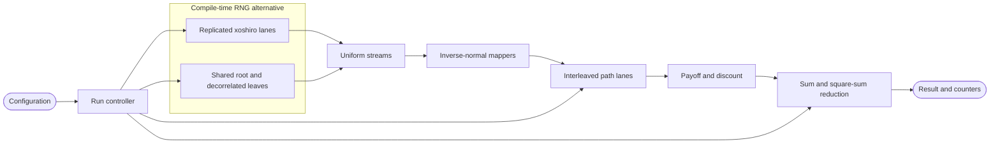
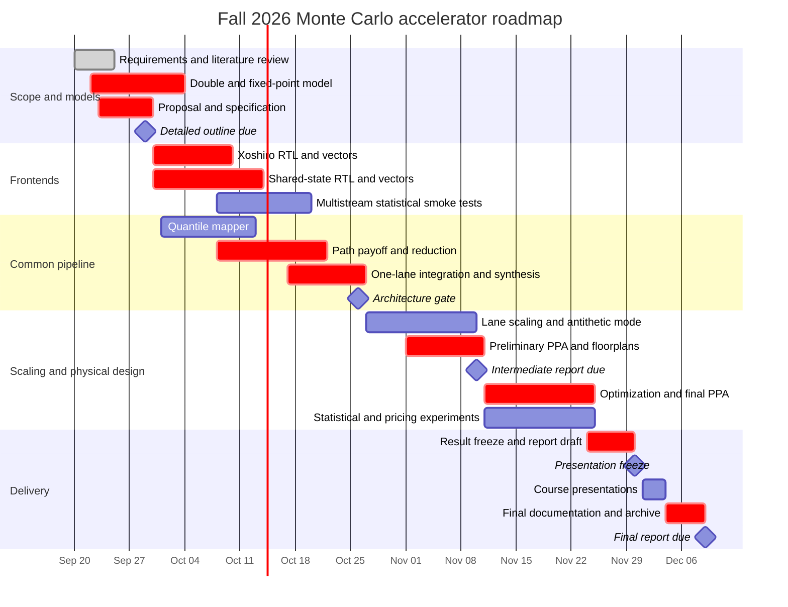

# Independent-lane versus state-shared Monte Carlo acceleration

_Deep-research project plan for ECE 382M-7 VLSI I, Fall 2026 — prepared 2026-09-20_

---

## Executive recommendation

Build a **trial-based, streaming Monte Carlo option-pricing IP block** with two interchangeable random-number frontends:

1. **Independent-lane baseline:** one `xoshiro128++` state machine per lane, with jump-separated initial states
2. **State-shared design:** one ThundeRiNG-inspired 64-bit LCG root transition shared by all lanes, followed by per-lane offsets, output permutation, and xorshift decorrelation

Both frontends must drive the **same** inverse-normal mapper, finite-step Black–Scholes path update, payoff logic, antithetic-path option, and sum/square-sum reduction. Implement every measured configuration in synthesizable SystemVerilog and run it through the same 45 nm synthesis and place-and-route flow.

> **Primary research question:** At what lane count, if any, does a state-shared multistream generator become more area- and energy-efficient than replicated multiplier-free generators in an ASIC flow, while preserving random quality and option-price convergence?

This comparison is analogous to the all-digital versus mixed-signal PLL example: the two designs expose the same function and interface, share downstream blocks, and are compared with matched constraints across quality, performance, power, and area. It is also distinct from the 2025 Monte Carlo project, which replaced trial simulation with repeated 256-point FFT convolution.

### Scope boundary

The minimum viable project is deliberately narrower than a production quantitative-finance library:

- **Required workload:** European call pricing under finite-step geometric Brownian motion
- **Required validation:** analytic Black–Scholes price plus a double-precision Python cycle/bit reference
- **Required scale study:** `LANES = {1, 2, 4, 8}`; add `16` only if timing and routing close early
- **Required numeric study:** at least two fixed-point configurations selected by range/error analysis
- **Required optimization:** antithetic paths and one hardware optimization per frontend
- **Required physical result:** routed layout, post-route timing, area, and activity-based power for representative configurations
- **Optional workload:** arithmetic-average Asian call
- **First extension:** TreeGRNG as a direct discrete-Gaussian frontend
- **Second extension:** scrambled Sobol quasi-Monte Carlo, then Brownian bridge
- **Explicitly out of core scope:** Heston, multilevel Monte Carlo, and a second FFT-convolution engine

The central contribution is not a claim that state sharing must win. A measured result that replicated xoshiro remains superior in a 45 nm ASIC is scientifically useful because ThundeRiNG's published advantage is tied partly to FPGA DSP and BRAM economics.[^1]

## Requirements and lessons from prior projects

### Course deliverables and dates

The course asks for a reasonably sophisticated VLSI module, experimental evidence about the proposed architectures, and suggestions for improvement. Teams are four students by default, and each student must own an identifiable component that integrates into a coherent design. The final report must contain specification, design, user, testing, and optimization material plus source code and layout. The design document must also record tools, naming conventions, regression control, issue tracking, and design-review practice. The project brief explicitly lists hardware-accelerated option pricing and allows either distribution convolution or trial simulation.[^2]

| Date | Required milestone | Planned evidence |
|---|---|---|
| 2026-09-29 | Detailed outline and deliverables | Approved scope, I/O, hypotheses, architecture, ownership, target metrics, test matrix |
| 2026-11-10 | Intermediate results | Python model, both RNG frontends, one-lane integrated RTL, preliminary statistical tests and synthesis |
| 2026-12-01 / 2026-12-03 | Presentation | Frozen comparison plots, layout images, reproducible demonstration |
| 2026-12-09 | Final report | All required documents, code, tests, optimization history, reports, and routed layouts |

### What the strongest examples do

The local examples consistently reward **matched comparisons with measured iterations**, not a single final implementation:

- The PLL project built two complete clock generators with a shared I/O contract and divider, verified blocks before integration, and compared lock time, jitter, power, area, eye metrics, and temperature behavior. Its report structure—specification, two designs, block results, direct comparison, limitations, and conclusion—is the model for this project.[^3]
- The all-digital LDO project reproduced prior art, identified concrete failure modes, proposed a SAR alternative, and quantified settling-time, area, power, and accuracy improvements.[^4]
- The I²S project compared FSM and shift-register implementations over several optimization iterations and reported the trade-off rather than hiding regressions.[^4]
- The 2025 project overview shows that successful algorithm-focused teams pair Python or MATLAB models with RTL, report precision error as well as PPA, and take at least one configuration through place-and-route.[^4]

The PLL example also exposes a comparison pitfall to avoid: its reported all-digital area came from automated place-and-route while the mixed-signal area was a sum of separately custom-laid-out blocks. The report acknowledged that this made the area comparison uncertain. This project will use the same standard-cell library, clock, constraints, utilization policy, activity method, and physical flow for both alternatives.

### Requirement-to-evidence map

| Course requirement | Planned project artifact |
|---|---|
| High-level specification | Block diagram, interface table, numeric formats, workloads, target PPA and accuracy |
| Design document | Algorithms, pipeline, lane scaling, floorplan, fixed-point analysis, tools and conventions |
| User document | Register/configuration sequence, timing, valid/ready behavior, seed rules, outputs |
| Testing strategy and results | Unit/integration/system regressions, coverage, bug log, statistical and pricing tests |
| Optimization strategy and results | Before/after synthesis table for pipelining, fanout, mapper precision, and antithetic paths |
| Source and layout | SystemVerilog, Python golden model, testbenches, scripts, reports, GDS/DEF or course-equivalent layout |
| Teamwork | Ownership table, weekly reviews, pull-request record, integration responsibilities |

## Literature synthesis and scope selection

### Evidence that shapes the design

ThundeRiNG demonstrates that a shared LCG root plus cheap per-stream leaf transitions and xorshift decorrelation can generate many statistically independent FPGA streams. It reports BigCrush and PractRand validation, 655 Gsample/s raw throughput, and a Black–Scholes case study with 2.33× throughput and 6.83× power-efficiency improvements over its GPU comparator.[^1] Those numbers motivate the architecture but cannot be transferred directly to a standard-cell ASIC.

The official Vitis Quantitative Finance library is the best open reference for system decomposition. Its `2024.2` branch includes xoshiro generators with jump separation, Sobol, Gaussian transforms, Brownian bridge, antithetic sampling, path generation, path pricing, and sum/square-sum accumulation. Its Monte Carlo dataflow sustains an initiation interval of one where possible and replicates complete engines for parallelism.[^5]

Ma, Muslim, and Lavagno show that path replication, inner-loop pipelining, and interleaving independent paths are the essential acceleration mechanisms. Their FPGA implementations of Black–Scholes and Heston outperformed the compared GPU while using a small fraction of its energy per step, but they identify Gaussian generation as a major resource target.[^6]

TreeGRNG is attractive because it replaces arithmetic transforms with constant-threshold comparisons. A matched INT8 45 nm synthesis reports 3.7× better energy efficiency and 5.8× better throughput per area than its comparison design. However, its finite discrete distribution must be judged on tail-sensitive pricing error, not only its K–S statistic.[^7]

### Candidate scope comparison

Scores use `5` as strongest. Feasibility assumes four students and the published course dates.

| Candidate comparison | Novelty | VLSI depth | Feasibility | Verification value | Decision |
|---|---:|---:|---:|---:|---|
| Replicated xoshiro vs state-shared ThundeRiNG-inspired RNG | 4 | 5 | 5 | 5 | **Core project** |
| Inverse-CDF or Box–Muller vs TreeGRNG Gaussian generation | 5 | 5 | 3 | 5 | First extension |
| Pseudorandom MC vs scrambled Sobol QMC plus Brownian bridge | 5 | 4 | 3 | 5 | Second extension |
| Black–Scholes vs Heston path engines | 3 | 5 | 2 | 4 | Future work |
| Trial-based MC vs 256-point FFT convolution | 2 | 5 | 1 | 4 | Reject; repeats 2025 and doubles scope |

The core comparison has the best balance because both frontends can be developed and unit-tested independently, while one common backend prevents duplicated effort. It also produces a meaningful negative-result path: xoshiro may stay more efficient at every tested lane count because constant rotates, XORs, and adds map well to ASIC cells, whereas the state-shared design retains a 64-bit root multiplier and per-lane decorrelator state.

## Research questions and success criteria

### Questions and falsifiable hypotheses

| ID | Question | Hypothesis | Result that would refute it |
|---|---|---|---|
| RQ1 | How do area, power, frequency, and energy/sample scale with lane count? | Shared state will have a worse fixed cost but a lower marginal cost per lane | Replicated xoshiro has equal or lower marginal cost through `LANES=16` |
| RQ2 | Do both frontends preserve intra- and inter-stream random quality? | Jump-separated xoshiro and decorrelated shared streams will pass the same selected batteries | Repeatable failures, cross-stream correlation, or seed-dependent pricing bias |
| RQ3 | Does RNG choice affect Gaussian quality or option-price convergence after the common mapper? | With matched mapper and numeric format, convergence curves will be statistically indistinguishable | Persistent architecture-dependent price bias or confidence-interval undercoverage |
| RQ4 | Does antithetic sampling improve accuracy per joule? | It will reduce estimator variance enough to offset the extra path-state/datapath cost | Equal or worse RMSE×energy at matched path count and confidence |
| RQ5 | Does an FPGA-oriented state-sharing design transfer to ASIC? | A crossover may appear only at moderate or high lane counts | No crossover within routed configurations; this remains a valid conclusion |

The analysis must report uncertainty rather than select the best-looking seed. Monte Carlo accuracy plots will aggregate at least 30 independent seeds per design point where runtime permits, with identical seed sets and input parameters across architectures.

### Completion gates

| Level | Criterion | Pass condition |
|---|---|---|
| Functional | Frontend state transitions | Bit-exact agreement with Python for at least `10^5` words per selected seed and lane |
| Functional | Integrated pricing | Cycle/bit-exact RTL agreement with the fixed-point Python model for directed and randomized tests |
| Statistical | Uniform output | TestU01 SmallCrush plus selected Crush tests show no repeatable failure; interleaved-stream and pairwise tests show no material cross-lane dependence |
| Statistical | Gaussian mapper | Absolute mean error ≤ `0.01`, variance error ≤ `1%`, and empirical K–S distance ≤ `0.01` at the selected format |
| Financial | European call | Across repeated seeds at `N ≥ 2^20`, mean relative error to the analytic value ≤ `1%` and observed 95% interval coverage is reported |
| Numeric | Hardware-induced bias | Fixed-point result differs from the same-sample double-precision model by ≤ `0.25` Monte Carlo standard errors |
| Timing | Routed design | `LANES={1,4,8}` closes a `5 ns` clock or the achieved limit is documented with critical-path traces |
| Physical | Layout | Zero geometry/connectivity violations for the final reported layouts |
| Optimization | Measured improvement | At least two before/after changes have quantified PPA or error impact; regressions are retained in the table |
| Reproducibility | One-command regression | A documented command regenerates functional results and another regenerates analysis plots from saved reports |

BigCrush, PractRand beyond hundreds of gigabytes, routed `LANES=16`, Asian pricing, and TreeGRNG are stretch evidence, not conditions for passing the core project.

### Target—not guaranteed—PPA envelope

The course explicitly allows back-of-the-envelope specification targets. Initial targets are intentionally broad and must be revised after the first synthesis:

| Metric | Core target | Rationale |
|---|---:|---|
| Clock | `200 MHz` (`5 ns`) | Conservative relative to several 45 nm class examples |
| Raw RNG throughput | `LANES` 32-bit words/cycle after fill | Enables direct scaling comparison |
| Path-update throughput | Up to `LANES` updates/cycle after context interleaving | Hides recurrence pipeline latency |
| Eight-lane area | `< 1.5 mm²` including common backend | Below the prior FFT-convolution core while leaving routing margin |
| Eight-lane power | `< 100 mW` at representative activity | A planning bound; energy/path is the primary comparison |
| European path rate | `≥25 Mpath/s` for 8 lanes and 64 steps at 200 MHz after fill | `8 × 200M / 64`, before controller overhead |

## Proposed IP specification

### Functional behavior

The IP estimates the discounted expected payoff of a call option by simulating independent price paths. The core model uses Euler–Maruyama discretization of geometric Brownian motion:

$$
S_{t+\Delta t}=\max\left(0, S_t\left[1+r\Delta t+\sigma\sqrt{\Delta t}Z_t\right]\right),
\qquad Z_t\sim\mathcal{N}(0,1).
$$

Software precomputes `drift = rΔt`, `diffusion = σ√Δt`, and `discount = exp(-rT)`. This keeps square root, division, and exponential units out of the required RTL while preserving finite-step trial simulation. The terminal payoff is `discount × max(S_T - K, 0)`. The optional Asian mode maintains a running price sum and applies `max(average(S)-K,0)` at maturity.

The hardware returns `sum(payoff)`, `sum(payoff²)`, completed path count, and cycle count. Host software derives the mean, sample variance, standard error, and confidence interval. Keeping final division and square root in software avoids a large block that contributes nothing to the architecture comparison.

### Interface contract

A simple configuration-and-result interface is preferable to an AXI implementation for this course scope. AXI wrapping can be added after the core comparison closes.

| Signal | Direction | Width | Meaning |
|---|---|---:|---|
| `clk`, `rst_n` | Input | 1 | Clock and active-low synchronous reset |
| `cfg_valid`, `cfg_ready` | Input/output | 1 | Configuration handshake |
| `start` | Input | 1 | Begin a run after accepted configuration |
| `s0`, `strike` | Input | 32 each | Initial price and strike |
| `drift`, `diffusion`, `discount` | Input | 32 each | Precomputed model constants |
| `num_steps` | Input | 16 | Time steps per path; powers of two simplify optional averaging |
| `num_paths` | Input | 32 | Requested effective path count |
| `seed_root` | Input | 64 | Root seed; all-zero illegal cases are remapped deterministically |
| `mode_antithetic`, `mode_asian` | Input | 1 each | Variance-reduction and payoff mode selects |
| `busy`, `done` | Output | 1 | Run status |
| `payoff_sum` | Output | 64 | Fixed-point payoff sum |
| `payoff_sq_sum` | Output | 96 | Fixed-point squared-payoff sum |
| `paths_completed`, `cycles_elapsed` | Output | 32/64 | Accounting and throughput evidence |
| `error_flags` | Output | 8 | Invalid configuration, overflow, saturation, or seed conditions |

`RNG_ARCH`, `LANES`, mapper precision, path width, and context count are compile-time parameters so synthesis can optimize each experimental point. Runtime selection between large alternative frontends would retain unused logic and invalidate the PPA comparison.

### Initial numeric formats

These formats are starting points, not frozen choices. The Python range sweep must establish overflow probability and quantify each rounding site before RTL sign-off.

| Quantity | Initial format | Notes |
|---|---|---|
| Uniform sample | `uint32` | Common output contract for both RNG frontends |
| Gaussian sample | Signed `Q4.12` in 16 bits | Covers approximately `[-8, 8)`; mapper's actual tail is separately measured |
| Price, strike, payoff | Signed `Q12.20` in 32 bits | Approximate range `[-2048, 2048)` |
| Drift/diffusion/factor | Signed 32-bit fixed point, binary point chosen by sweep | Guard bits retained through multiply-add |
| Product intermediate | 64 bits | Round-to-nearest-even, then saturate to the path format |
| Payoff sum | 64 bits | Sized for the maximum planned path count |
| Payoff square and sum | 64-bit square, 96-bit accumulated | Prevents silent overflow in confidence calculations |

Every narrowing conversion must use one named rounding/saturation module. Silent Verilog truncation is prohibited in the datapath.

### Common inverse-normal mapper

The integration-first mapper is a symmetric quantile ROM addressed by the high bits of the 32-bit uniform sample. Entries use midpoint probabilities so zero and one never map to infinities. The initial configurations use `GAUSS_ADDR_BITS={8,10}` and a 16-bit output. Only half the table is stored because `Φ⁻¹(1-u)=-Φ⁻¹(u)`.

This mapper is intentionally common to both RNG architectures. Its global and tail error will be measured independently, and RNG-only PPA will be reported so mapper cost cannot hide frontend scaling. If replicated ROM logic exceeds 25% of total area or fails the tail criterion, replace it with a segmented piecewise-linear mapper based on nonuniform CDF regions; do not change only one architecture.[^8]

## Architecture and implementation plan

### Top-level dataflow

Only one RNG frontend is synthesized in a given experiment. Everything after the uniform-stream boundary is identical.

### Frontend A: replicated xoshiro lanes

Each lane stores four 32-bit state words. The `xoshiro128++` transition uses XORs, shifts, fixed rotates, and additions, so it maps naturally to standard cells. Initialization is performed in the Python/configuration layer: lane zero receives the root state, and successive lanes receive states separated by the published jump polynomial. The all-zero state is never permitted.

Required implementation points:

- Produce one 32-bit word per lane per cycle after pipeline fill
- Preserve a debug mode that dumps raw words before Gaussian mapping
- Verify `jump` and `long_jump` state vectors against an independent software implementation
- Register lane outputs uniformly so both architectures present the same latency contract to the mapper
- Record state-register, combinational, clock-power, and total area separately

The main optimization experiment is output/state-update retiming. Compare an unretimed lane against a timing-closed pipelined implementation without changing the generated sequence.

### Frontend B: shared-state decorrelated lanes

The state-shared design follows the equations and quality principles of ThundeRiNG but is an independent SystemVerilog implementation, so the report must call it **ThundeRiNG-inspired** rather than implying reproduction of every FPGA optimization.[^1]

1. A root transition computes `x[n+1] = a × x[n] + c mod 2^64`, where modulo is natural low-word truncation. Compile-time checks enforce the full-period conditions `a mod 4 = 1` and odd `c`.
2. Lane `i` forms a distinct leaf state `w_i = x + h_i mod 2^64`, using a unique compile-time `h_i` selected according to the paper's period-preserving derivation.
3. A PCG-style rotate/truncate permutation maps the leaf state to 32 bits.
4. A lane-local xorshift128 decorrelator produces 32 bits.
5. The final output is the XOR of the permuted leaf and decorrelator word.

A multicycle root multiplier creates a recurrence hazard. The first synthesis tests a constant-coefficient root multiply directly. If its latency exceeds one cycle at the target clock, implement `K` interleaved advance-`K` root contexts with compile-time coefficients, following the paper's look-ahead principle. This turns the root recurrence into one accepted state per cycle after fill rather than weakening the clock constraint.

The root state also creates high fanout. Compare two distribution networks at `LANES={8,16}`:

- **Balanced register tree:** lower endpoint latency and logarithmic fanout depth, with added registers
- **Daisy chain:** bounded local fanout and regular layout, with lane-dependent latency that must be aligned before mapping

The experiment must identify whether multiplier, leaf/decorrelator state, fanout buffering, or routing dominates the ASIC crossover.

### Common mapper and path lane

Each lane contains the same mapper and path update. A run processes path contexts round-robin:

1. Map uniform `u` to fixed-point `z`
2. Compute `factor = 1 + drift + diffusion × z`
3. Read the selected context's price
4. Compute `next_price = max(0, round_sat(price × factor))`
5. Update the optional running sum
6. At the final step, compute and emit payoff; otherwise return the context to the round-robin schedule

A naïve single-context lane can accept a new update only after the price-multiply result returns. The optimized lane allocates `CONTEXTS ≥ UPDATE_LATENCY` independent path states and cycles through them, removing the loop-carried pipeline stall. Report both implementations; this is a direct RTL version of the independent-path interleaving used in prior financial accelerators.[^6]

Antithetic mode creates paired contexts driven by `z` and `-z`. The comparison metric is not merely cycles: report area, energy, and RMSE for a fixed number of effective paths. If parallel antithetic datapaths exceed scope, use a folded pair update and report its lower throughput honestly.

### Reduction and controller

At each path completion, a lane emits one payoff and its square. A fixed adder tree reduces simultaneous lane outputs before wide accumulators update `sum` and `sum_sq`. The controller owns accepted-path accounting, flush latency, partial final batches, saturation flags, and deterministic `done` timing.

For reproducibility, a run is a pure function of configuration and seed. Resetting and replaying the same configuration must produce identical outputs and cycle count.

### Proposed module structure

| Module | Responsibility |
|---|---|
| `mc_accel_top` | Interface, compile-time architecture binding, global status |
| `run_controller` | Configuration checks, counters, start/flush/done sequencing |
| `xoshiro_rng_array` | Replicated lanes and jump-separated seed loading |
| `shared_rng_array` | Root recurrence, leaf offsets, permutation, decorrelation, fanout |
| `normal_quantile_map` | Symmetric fixed-point inverse-normal lookup or segmented replacement |
| `path_lane` | Context scheduling, Euler update, optional running average |
| `round_sat` | Shared, explicit rounding and saturation policy |
| `payoff_unit` | European and optional Asian call payoff, discounting |
| `payoff_reducer` | Lane tree, `sum`, `sum_sq`, overflow detection |
| `mc_pkg` | Widths, enums, structs, constants, compile-time checks |

The planned repository should separate `rtl/`, `tb/`, `model/`, `scripts/`, `constraints/`, `reports/`, and `results/`. Module/file names use lowercase `snake_case`, parameters use uppercase `SNAKE_CASE`, and active-low signals end in `_n`.

### Physical-design intent

Use a hierarchical, lane-oriented floorplan. Place the root generator near the center of the shared design; arrange leaf RNG, mapper, and path blocks in repeated columns; place the reduction tree and accumulators near the output edge. For the replicated design, keep each RNG with its corresponding mapper/path lane so the two alternatives do not receive artificial wire-length advantages. Use the same core aspect ratio and initial utilization target; if congestion forces different utilization, report both the reason and the sensitivity.

## Verification and experimental design

### Three-reference strategy

Verification uses three independent levels:

1. **Mathematical reference:** double-precision NumPy/SciPy model plus analytic Black–Scholes price
2. **Bit reference:** Python model with the exact fixed-point widths, rounding, saturation, table contents, seed transitions, and cycle scheduling
3. **RTL implementation:** SystemVerilog simulation, then gate-level and post-route checks for selected configurations

The double model tests the method; the bit model tests implementation equivalence. Comparing RTL only to an equally quantized model would miss mathematical bias, while comparing it only to floating point would make intentional quantization look like a logic bug.

### Layered regression plan

| Layer | Required tests | Coverage/evidence |
|---|---|---|
| Arithmetic primitives | Directed ties, signs, overflow, saturation, min/max values | Exhaustive where width permits; assertion on every saturation |
| xoshiro lane | Published/reference state vectors, seed replay, jump separation | `10^5` bit-exact words per selected seed |
| Shared RNG | Root recurrence, every leaf offset, rotation, xorshift, aligned output | Bit-exact vectors at `LANES={1,4,8}` |
| Stream interface | Reset, stalls if supported, partial final batch, repeated start | Protocol assertions and functional coverage |
| Gaussian mapper | All addresses, symmetry, monotonicity, endpoint handling | Exhaustive address test and error table |
| Path lane | One-step hand cases, zero volatility, zero drift, saturation, context hazards | Directed traces plus randomized differential test |
| Payoff/reduction | In/out/at-the-money options, odd path counts, sum widths | Exact sums and overflow assertions |
| Full system | Multiple seeds, steps, path counts, both frontends and antithetic modes | Cycle/bit-exact result and cycle count |
| Netlist/layout | Selected smoke tests with timing annotation | No unknowns, setup/hold failures, or connectivity violations |

A bug log records symptom, minimal reproducer, root cause, correction, and regression added. Functional coverage tracks architecture, lane count, mapper precision, path-step bins, option moneyness, antithetic mode, saturation, and partial-batch behavior.

### Randomness and distribution tests

Raw 32-bit words must be exported independently of the finance pipeline. For each final frontend and lane count:

- Run TestU01 SmallCrush on at least 16 individual streams and on round-robin interleaved streams
- Run selected Crush tests that target linear complexity, matrix rank, birthday spacing, and Hamming-weight behavior
- Run PractRand for a practical data volume if installation and runtime permit
- Measure per-stream bit balance, lag autocorrelation, and longest-run behavior
- Measure cross-stream Pearson, Spearman, and Kendall correlation over prespecified sample counts
- Verify no overlap in a bounded prefix for jump-separated xoshiro streams

Do not interpret one isolated p-value as proof of quality. Report the complete prespecified battery, repeat suspicious tests with new seeds, and distinguish a repeatable structural failure from the false positives expected when many tests are run. TestU01 is the established empirical suite, and interleaving plus pairwise tests follow the stronger multistream methodology used by ThundeRiNG.[^9]

After mapping to Gaussian values, evaluate `N={2^12,2^16,2^20}` samples using mean, variance, skew, excess kurtosis, empirical CDF/K–S distance, Anderson–Darling statistic, Q–Q error, and tail quantiles. Report errors near `|z|={2,3}` separately because a small global CDF error can conceal option-relevant tail distortion.

### Financial-accuracy tests

Use a fixed parameter grid rather than selecting favorable options:

| Case | `S0/K` | Volatility | Maturity | Purpose |
|---|---:|---:|---:|---|
| In the money | `1.2` | `0.2` | `1 year` | Stable positive payoff |
| At the money | `1.0` | `0.2` | `1 year` | Main comparison |
| Out of the money | `0.8` | `0.2` | `1 year` | Tail-sensitive payoff |
| High volatility | `1.0` | `0.6` | `1 year` | Numeric range and tail stress |
| Long maturity | `1.0` | `0.3` | `5 years` | Accumulated discretization error |

For each case, sweep `num_steps={8,16,32,64}` and path counts from `2^10` through at least `2^20`. Plot bias, RMSE, confidence width, and runtime/energy versus paths. Separate four error sources: Monte Carlo sampling, time discretization, Gaussian approximation, and fixed-point arithmetic. Black–Scholes supplies the analytic European-call reference.[^10]

Run at least 30 seeds for the primary design points. Report the mean error and a confidence interval across seeds, plus the fraction of hardware-produced 95% Monte Carlo intervals containing the analytic price. The same seeds and uniforms must be used for paired architecture comparisons wherever possible.

### PPA and scaling experiments

Use one scripted flow and matched settings for every comparison:

| Factor | Required levels |
|---|---|
| RNG architecture | `xoshiro`, `shared` |
| Lanes | `1`, `2`, `4`, `8`; `16` if routed |
| Datapath format | Two widths selected by Python error/range sweep |
| Mapper address bits | `8`, `10` in synthesis; retain the accurate choice for final P&R |
| Antithetic mode | Off/on for selected lane counts |
| Path steps | `16`, `64` for power activity and throughput |
| Implementation stage | RTL synthesis for full sweep; placed/routed for `1`, `4`, `8` and finalists |

Collect cell area by hierarchy, total core area, utilization, wirelength, buffering, clock-tree area, critical path, WNS/TNS, achieved frequency, dynamic/leakage power, words/s, path-updates/s, completed paths/s, energy/uniform word, energy/Gaussian sample, and energy/effective path. Use identical switching workloads and VCD/SAIF windows after warm-up. Report RNG-only and end-to-end metrics.

A recent FPGA Monte Carlo study provides the right reporting discipline: distinguish isolated-kernel from end-to-end speedup, expose numerical representation, report initiation interval and latency, and explain resource-scaling limits.[^11] This project should make no CPU/GPU speedup claim unless data transfer, initialization, stopping criteria, and numerical quality are matched.

### Required result figures

The final report should contain, at minimum:

1. Area and power versus lane count, with fitted fixed and marginal cost
2. Maximum frequency and throughput versus lane count
3. RNG-only and end-to-end energy per sample/path
4. Gaussian CDF/Q–Q and tail-error comparison
5. Price error and 95% confidence width versus number of paths
6. RMSE×energy with and without antithetic sampling
7. Fixed-point width versus error/area Pareto frontier
8. Final floorplans/layouts and critical-path traces for both frontends

## Team, workflow, and schedule

### Four-person ownership plan

Ownership is primary responsibility, not a silo. Each block has a second reviewer, and integration work is shared.

| Owner | Primary responsibility | Concrete outputs | Secondary review |
|---|---|---|---|
| Student A | Replicated xoshiro frontend | RTL, jump-separated seed generator, unit vectors, RNG quality export | Reviews shared-root math and seed policy |
| Student B | Shared-state frontend | Root/advance recurrence, leaf lanes, decorrelator, fanout alternatives | Reviews xoshiro state/retiming |
| Student C | Common finance pipeline | Quantile mapper, path contexts, payoff, reduction, double and bit Python models | Reviews numeric widths and statistical analysis |
| Student D | Verification and physical flow | Regression harness, assertions/coverage, synthesis/P&R/power scripts, result extraction | Reviews top-level control and reproducibility |

Student D must start tool-flow smoke tests immediately rather than wait for final RTL. Students A and B each take their frontend through synthesis once; Student C owns the first integrated one-lane model; all four review final plots and claims.

For a three-person team, combine xoshiro with verification automation and keep TreeGRNG/Sobol out of scope. For a five-person team, assign the fifth member TreeGRNG only after the October gate.

### Tools and project controls

| Function | Planned tool | Control |
|---|---|---|
| Mathematical/bit model | Python with NumPy; SciPy if available | Pinned seed manifest and saved parameter JSON |
| RTL simulation | Course-supported VCS; Verilator/cocotb only if already available | One command for unit and full regressions |
| Logic synthesis | Synopsys Design Vision/Compiler with course 45 nm library | Versioned constraints and generated reports |
| Place and route | Cadence Innovus, following the lab flow | Same library, corners, utilization policy, and scripts |
| Timing/power | PrimeTime or course-supported equivalents | Saved SDC and representative VCD/SAIF window |
| Statistical RNG tests | TestU01; PractRand if available | Raw binary stream plus exact generator metadata |
| Result analysis | Python scripts producing CSV and plots | Plots generated only from committed/raw report data |

Before September 29, run a tiny counter design through simulation, synthesis, and place-and-route to verify PDK/library/tool compatibility. This prevents the late PDK integration failure seen in a prior audio project.

Project control rules:

- `main` remains regression-clean; work enters through reviewed branches
- Every result row records git commit, architecture, parameters, seed set, tool version, corner, and constraint hash
- No generated PPA number is copied manually into a plot; parsers produce a canonical CSV
- Weekly code/design reviews rotate presenter and reviewer
- The issue log labels functional, numeric, statistical, timing, power, routing, and documentation defects
- A result is never deleted because it regressed; retain it as an optimization step with an explanation

### Schedule

The schedule intentionally places the first end-to-end integration more than two weeks before the interim report. Physical design begins before all optimizations are complete so floorplan and fanout problems can change the architecture while there is still time.

## Risks, gates, and deliverables

### Risk register

| Risk | Likelihood / impact | Early trigger | Mitigation | Fallback |
|---|---|---|---|---|
| Root recurrence cannot sustain one word/cycle | Medium / high | First root synthesis has latency >1 | Advance-`K` contexts and retiming | Report lower II and compare energy/sample fairly |
| Shared root fanout dominates timing/routing | High at 16 lanes / high | Buffer count or WNS rises sharply at 8 lanes | Balanced tree versus daisy-chain experiment | Route only through 8 lanes and model marginal trend cautiously |
| Quantile ROM dominates area | Medium / medium | Mapper >25% synthesized area | Symmetry, shared generation script, segmented PWL | Freeze 8-bit mapper and report its bias |
| Gaussian tails bias OTM/high-volatility prices | Medium / high | Tail quantiles or option grid fail criterion | Increase address bits or nonuniform tail segments | Restrict claims to measured domain; make TreeGRNG ineligible |
| Fixed-point overflow or saturation is common | Medium / high | Saturation flags in model sweep | Add integer/guard bits and rescale constants | Reduce supported input range in the user specification |
| A frontend fails repeatable RNG tests | Low/medium / critical | Same battery fails across seeds | Audit seeding, jump/offsets, alignment, decorrelator | Report failure and do not use that frontend for pricing claims |
| RTL simulation is too slow for long batteries | High / medium | Stream dump rate blocks testing | Use bit-exact compiled software generator after RTL vector equivalence | Run SmallCrush and bounded cross-stream tests; label limitation |
| Power estimates are incomparable | Medium / high | Different activity windows or unknown states | Shared workload and scripted warm-up/measurement windows | Limit conclusions to area/timing and report power uncertainty |
| Tool/PDK incompatibility appears late | Medium / critical | Tiny smoke design fails before proposal | Escalate immediately and lock one known lab flow | Synthesis-only fallback requires instructor agreement |
| Scope expands to TreeGRNG, Sobol, and Heston | High / critical | Core one-lane integration slips past Oct. 26 | Enforce gate and backlog extensions | Deliver only the matched core comparison |

### Decision gates

| Date | Gate | Continue only if | Otherwise |
|---|---|---|---|
| 2026-09-29 | Scope freeze | Interface, widths, tests, ownership, and tools are approved | Remove Asian mode and all extensions |
| 2026-10-09 | Frontend gate | Both generators are bit-exact and export raw streams | Reduce lane target; focus on fixing quality/correctness |
| 2026-10-26 | Architecture gate | One-lane full pipeline passes regression and synthesis | Freeze TreeGRNG/Sobol; simplify mapper or contexts |
| 2026-11-10 | Interim gate | Both frontends have preliminary PPA and one routed design exists | Route four lanes rather than eight; prioritize final evidence |
| 2026-11-17 | Physical gate | Eight lanes has a credible timing/congestion path | Finalize four-lane comparison and model higher scale only |
| 2026-11-24 | Result freeze | Prespecified matrix is complete and plots are reproducible | Stop optimization and document missing cells/limitations |

### Proposal-ready deliverables

The September 29 outline should promise only these items:

1. Two parameterized RNG frontends with a common 32-bit stream contract
2. One common Gaussian mapper and finite-step European-call path engine
3. Double-precision and bit-accurate Python references
4. Unit, integration, statistical, and financial validation
5. Synthesis sweep over frontend and lane count
6. Routed matched configurations with area, timing, and activity-based power
7. One common variance-reduction experiment using antithetic paths
8. Final specification, design, user, testing, optimization, teamwork, source, and layout artifacts

### Final artifact checklist

- [ ] `SPEC.md` with supported ranges, formats, I/O, targets, and exclusions
- [ ] `DESIGN.md` with algorithms, diagrams, hierarchy, floorplan, and trade-offs
- [ ] `USER.md` with configuration sequence, seed rules, timing, and result interpretation
- [ ] Python double and fixed-point models with deterministic seed manifests
- [ ] Synthesizable SystemVerilog for both frontends and common backend
- [ ] Unit/integration/system regressions, assertions, coverage, and bug log
- [ ] Raw RNG streams and statistical-test commands/results
- [ ] Synthesis/P&R/timing/power scripts and unedited reports
- [ ] Canonical result CSV plus reproducible plot scripts
- [ ] Final routed layouts and verification reports
- [ ] Presentation, final report, and archived demonstration vectors
- [ ] Team-contribution and code-review summary

### Recommended final-report structure

Use the PLL report's comparative structure, but add stronger experimental controls:

1. Abstract and contribution
2. Problem, prior work, and why trial-based simulation is distinct from the 2025 FFT design
3. Shared specification and I/O
4. Architecture A: replicated xoshiro
5. Architecture B: shared-state decorrelated generator
6. Common Gaussian, path, payoff, and reduction pipeline
7. Fixed-point and statistical methodology
8. Functional verification and bug history
9. PPA, scaling, accuracy, and convergence results
10. Direct matched comparison and optimization history
11. User/integration guide and supported operating range
12. Limitations, negative results, future TreeGRNG/Sobol/Heston work
13. Team contributions and conclusion

## References

[^1]: H. Tan, X. Chen, Y. Chen, B. He, and W.-F. Wong. (2021). “ThundeRiNG: Generating Multiple Independent Random Number Sequences on FPGAs.” _Proceedings of the ACM International Conference on Supercomputing_, 115–126. https://doi.org/10.1145/3447818.3461664

[^2]: University of Texas at Austin ECE 382M-7. (2026). “Final Project Information,” pp. 1–3 and 8–9. [Local course project brief](./course/2026Fall_VLSI_I_Class_Project.pdf)

[^3]: M. Chowdhury et al. (2025). “All-Digital Versus Mixed-Signal Phase Locked Loops.” [Local prior-project report](./course/All_Digital_Versus_Mixed_Signal_Phase_Locked_Loops.pdf)

[^4]: University of Texas at Austin ECE 382M-7. (2026). “What Last Year's Class Built.” [Local 2025 project overview](./course/Overview%20of%202025%20Project%20Submissions%20as%20a%20Guide%20for%20Project%20Selections.pdf) and [sample-project archive](./course/Project_export.zip)

[^5]: AMD/Xilinx. (2024). “Vitis Quantitative Finance Library,” branch `2024.2`. https://github.com/Xilinx/Vitis_Libraries/tree/2024.2/quantitative_finance

[^6]: L. Ma, F. B. Muslim, and L. Lavagno. (2016). “High Performance and Low Power Monte Carlo Methods to Option Pricing Models via High Level Design and Synthesis.” _European Modelling Symposium_, 157–162. https://doi.org/10.1109/EMS.2016.036

[^7]: J. Crols, G. Paim, S. Zhao, and M. Verhelst. (2024). “TreeGRNG: Binary Tree Gaussian Random Number Generator for Efficient Probabilistic AI Hardware.” _DATE_, 1–6. https://doi.org/10.23919/DATE58400.2024.10546516

[^8]: C. de Schryver et al. (2012). “A Hardware Efficient Random Number Generator for Nonuniform Distributions with Arbitrary Precision.” _International Journal of Reconfigurable Computing_, 2012, 1–11. https://doi.org/10.1155/2012/675130

[^9]: P. L’Ecuyer and R. Simard. (2007). “TestU01: A C Library for Empirical Testing of Random Number Generators.” _ACM Transactions on Mathematical Software_, 33(4). https://doi.org/10.1145/1268776.1268777

[^10]: F. Black and M. Scholes. (1973). “The Pricing of Options and Corporate Liabilities.” _Journal of Political Economy_, 81(3), 637–654. https://doi.org/10.1086/260062

[^11]: H. Gutiérrez Arance et al. (2026). “FPGA Acceleration of Matrix-Element Calculations for Monte Carlo Event Generation.” _Computer Physics Communications_, 329, 110394. https://doi.org/10.1016/j.cpc.2026.110394

